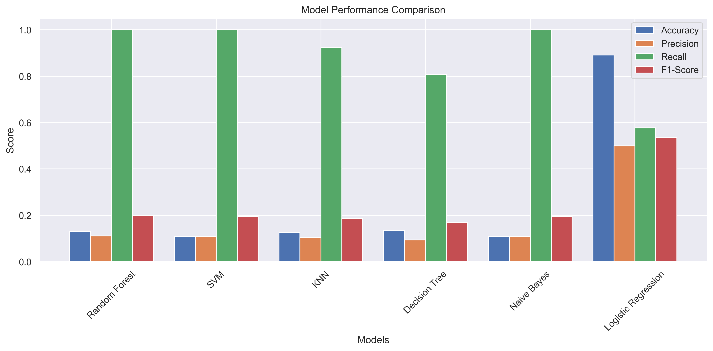

# Parkinson's Disease Prediction System

A web-based application that uses machine learning to predict Parkinson's Disease based on voice measurements. The system employs multiple machine learning models and provides a user-friendly interface for inputting voice measurements and viewing predictions.


*Figure 1: System Overview - Main components and workflow*

## Features

### 1. Multiple Model Support
- Random Forest Classifier
- Support Vector Machine (SVM)
- K-Nearest Neighbors (KNN)
- Decision Tree
- Naive Bayes
- Logistic Regression


*Figure 2: Model Performance Comparison - Accuracy, Precision, Recall, and F1-Score*

### 2. Model Performance Metrics
- Accuracy
- Precision
- Recall
- F1-Score
- Specificity
- Sensitivity
- Confusion Matrix


*Figure 3: Detailed Performance Metrics for Each Model*

### 3. User Interface Features
- Real-time voice measurement calculator
- Sample data input option
- Detailed prediction results
- Model comparison table
- History of previous predictions
- Responsive design for all devices


*Figure 4: Main Web Interface - Input Form and Calculator*


*Figure 5: Prediction Results Display*

### 4. Voice Measurement Calculator
- Input validation
- Real-time calculations
- Normal range indicators
- Copy to prediction form functionality


*Figure 6: Voice Measurement Calculator with Real-time Validation*

### 5. Prediction History
- Stores last 10 predictions
- View previous measurements
- Load previous values
- Delete individual entries
- Clear all history


*Figure 7: Prediction History Management*

## Setup Instructions

### Prerequisites
- Python 3.7 or higher
- pip (Python package installer)

### Installation

1. Clone the repository:
```bash
git clone <repository-url>
cd Parkinson-s-DiseaseML
```

2. Install required packages:
```bash
pip install -r requirements.txt
```

3. Ensure all model files are present:
- rf_clf.pkl (Random Forest model)
- svm_clf.pkl (SVM model)
- knn_clf.pkl (KNN model)
- dt_clf.pkl (Decision Tree model)
- nb_clf.pkl (Naive Bayes model)
- lg_clf.pkl (Logistic Regression model)
- scaler.pkl (Standard Scaler)
- data.csv (Dataset)

### Running the Application

1. Start the Flask server:
```bash
python app.py
```

2. Open your web browser and navigate to:
```
http://localhost:5000
```

## Usage Guide

### Making a Prediction

1. Enter voice measurements:
   - MDVP:Fo (Hz)
   - MDVP:Fhi (Hz)
   - MDVP:Flo (Hz)
   - MDVP:Jitter (%)
   - MDVP:Jitter(Abs)
   - And other required measurements


*Figure 8: Voice Measurement Input Form*

2. Use the calculator:
   - Input values in the calculator section
   - View real-time calculations
   - Check if values are within normal ranges
   - Copy values to the prediction form

3. Submit for prediction:
   - Click the "Predict" button
   - View the prediction result
   - See confidence level
   - Check predictions from all models

### Viewing Model Performance

1. Model Comparison Table:
   - View accuracy, precision, recall, and F1-score
   - Compare performance across models
   - See confusion matrix details
   - Identify the best performing model


*Figure 9: Detailed Model Performance Metrics*

2. Performance Metrics:
   - Accuracy: Overall prediction accuracy
   - Precision: True positive rate
   - Recall: Sensitivity to positive cases
   - F1-Score: Harmonic mean of precision and recall
   - Specificity: True negative rate
   - Sensitivity: True positive rate

### Managing History

1. View History:
   - See previous predictions
   - View measurement values
   - Check prediction results

2. History Actions:
   - Load previous values
   - Delete individual entries
   - Clear all history

## Technical Details

### Machine Learning Models
- Random Forest: Best performing model
- SVM: Good for non-linear data
- KNN: Simple and effective
- Decision Tree: Easy to interpret
- Naive Bayes: Fast and efficient
- Logistic Regression: Linear model baseline


*Figure 10: Machine Learning Model Architecture*

### Data Processing
- Standard scaling of features
- Train-test split (80-20)
- Cross-validation for model evaluation


*Figure 11: Data Processing Pipeline*

### Web Technologies
- Frontend: HTML, CSS, JavaScript
- Backend: Flask (Python)
- Data Storage: Local Storage (Browser)
- UI Framework: Bootstrap


*Figure 12: Technology Stack Overview*

## Contributing

1. Fork the repository
2. Create a feature branch
3. Commit your changes
4. Push to the branch
5. Create a Pull Request

## License

This project is licensed under the MIT License - see the LICENSE file for details.

## Acknowledgments

- Dataset: UCI Machine Learning Repository
- Machine Learning: scikit-learn
- Web Framework: Flask
- UI Framework: Bootstrap

## Screenshots Gallery


*Figure 13: Mobile Responsive View*


*Figure 14: Dark Mode Interface*


*Figure 15: Error Handling and Validation*